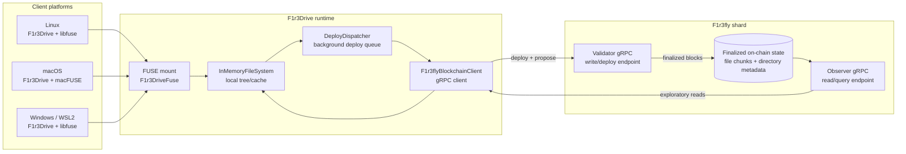

# F1r3Drive Multi-OS File Sharing Architecture

This document describes the architecture and operating model for F1r3Drive file sharing across Linux, macOS, and Windows via WSL2.

F1r3Drive is a FUSE-based filesystem backed by the F1r3fly blockchain. Files written into the mounted drive are staged locally, deployed to a F1r3fly shard, finalized on-chain, and then fetched by other clients that mount the same wallet.

For setup and installation details, see:

- [README.md](../README.md)
- [INSTALLATION.md](../INSTALLATION.md)
- [Demo.md](../Demo.md)
- [docs/configuration.md](configuration.md)
- [docs/system_data_flow.md](system_data_flow.md)
- [docs/rholang_data_storage.md](rholang_data_storage.md)

---

## Supported demo platforms

| Platform | Supported path | FUSE dependency |
|---|---|---|
| Linux | Native Java process using JNR-FUSE | libfuse |
| macOS | Native Java process using JNR-FUSE | macFUSE |
| Windows | Ubuntu on WSL2 using the Linux/libfuse path | WSL2 + libfuse |

Native Windows FUSE/WinFsp support is not part of the current supported workflow. Windows demonstrations should use WSL2.

---

## Architecture



---

## Data flow

### Write flow

When a user creates or edits a file in the mounted wallet directory:

1. The operating system sends a FUSE operation to `F1r3DriveFuse`.
2. `F1r3DriveFuse` translates the operation into the internal filesystem API.
3. `InMemoryFileSystem` updates the local in-memory tree/cache.
4. The write is acknowledged locally so the file appears immediately to the writer.
5. `DeployDispatcher` queues one or more blockchain deploys for file content and directory metadata.
6. `F1r3flyBlockchainClient` sends deploys to the validator gRPC endpoint.
7. After proposal and finalization, the file state becomes available from the shard.

A local write is not sufficient evidence of cross-platform availability. Other machines can reliably read the file only after deploy finalization succeeds.

### Read flow

When another platform mounts the same wallet:

1. The F1r3Drive process connects to the configured validator and observer endpoints.
2. The wallet is unlocked using the configured REV address and private key.
3. F1r3Drive fetches finalized directory and file metadata from the observer.
4. Fetched on-chain files are represented locally as `FetchedFile` / `FetchedDirectory` nodes.
5. The user reads files through the mounted filesystem path.

---

## Shard endpoints

F1r3Drive requires two gRPC endpoints:

| Endpoint | Purpose | Typical local demo port |
|---|---|---:|
| Validator gRPC | Accepts deploys/writes | `40412` |
| Observer gRPC | Serves finalized reads/query state | `40452` |

On the machine running the shard, these endpoints are usually referenced as `localhost`. Remote clients such as macOS or WSL should use the shard host or IP address.

Endpoints are configured via CLI flags (see [docs/configuration.md](configuration.md) for the full reference):

```bash
java -jar build/libs/f1r3drive-app.jar <mount-point> \
  --key-file <aes-key-file> \
  --host <shard-host-or-ip> --port 40412 \
  --observer-host <shard-host-or-ip> --observer-port 40452 \
  --address <rev-address> --private-key <key>
```

---

## f1r3node-rust: cost accounting and File I/O

The `fileio-phase-1-2` line of f1r3node-rust (the Rust shard used for synchronized storage, EPIC-001) changes two things a F1r3Drive client must know about. Terms are defined in the [Glossary](Glossary.md).

### Cost accounting

The phlo gas market is removed. Deploy capacity is derived by the protocol from the signer's REV custody in the `SystemVault` — the wallet F1r3Drive unlocks is also what funds its deploys.

- `phloPrice` and `phloLimit` are **removed from the wire** (`DeployDataProto` reserves their field tags). The deploy path must not set them against a fileio-era shard.
- The `cost` reported for a processed deploy is a scalar (COMM count + canonical byte cost), **not** the physical REV debit. Settlement proof lives in the new deploy-response evidence: funding certificate, cost witness, pre/post state hashes, admission status.
- A deploy whose budget exhausts fails deterministically with `out_of_phlogistons` and all its effects revert — for F1r3Drive this means a write that was locally acknowledged never reaches the chain until the wallet is funded and the deploy retried.
- `POST /api/estimate-cost` previews cost; pass the real deployer key or the estimate can be far lower than the real charge.

### File I/O

The shard now hosts a capability-secured POSIX filesystem that Rholang deploys reach through the genesis-published `Fs` capability (`openFile`/`openDir` by logical name). Client-relevant facts:

- **No new gRPC surface.** The `DeployService` RPCs are unchanged; File I/O is used entirely from Rholang deploy source. F1r3Drive's channel-based storage model keeps working as-is; File I/O is an additional capability future storage can target.
- Capabilities run in **oracular** (node-local) or **consensus** mode (WAL-journaled, snapshotted in 4 MiB Merkle-anchored chunks, replayed identically by every validator).
- The shard operator must provision logical names via the `storage { *-static-files/dirs }` config buckets; unprovisioned names return `FSERR_UNSUPPORTED`. Consensus buckets additionally require `consensus-fs-snapshot-dir` and `consensus-fs-snapshot-retain >= 2`.
- Every File I/O syscall carries a consensus-fixed cost weight (reads charge on the requested byte count; writes charge double per byte for the WAL append), so file operations draw down the same wallet REV as ordinary deploys.
- Nodes append a consensus-runtime fingerprint to `network_id` (`#cf<hex>`); shard nodes built with different consensus constants refuse to peer — mixed-build demo shards will not form.

---

## Fresh remount behavior

In the current implementation, remote on-chain state is fetched when a wallet is mounted and unlocked. Existing mounts may not immediately live-refresh files written by another platform.

For reliable cross-platform verification:

1. Write the file on platform A.
2. Wait for deploy finalization on platform A.
3. Reset/remount platform B.
4. Verify the file on platform B.

This behavior is important for demos and troubleshooting. If a file was written from macOS or WSL after Linux was already mounted, Linux may need a fresh remount before the new file appears.

---

## Verification model

The demo helper scripts (maintained outside this repository, alongside the demo/`shardctl` tooling in [system-integration](https://github.com/F1R3FLY-io/system-integration)) use SHA-256 checksums to verify file integrity.

Each demo write creates two files:

```text
<label>.txt
<label>.txt.sha256
```

- `<label>.txt` contains the demo content.
- `<label>.txt.sha256` contains the expected SHA-256 hash of the content.

Verification recalculates the SHA-256 hash of `<label>.txt` and compares it with the expected value in `<label>.txt.sha256`.

Successful verification indicates that the file content read from the mounted filesystem matches the expected content.

---

## Operational notes

- Keep the F1r3Drive mount process running while using the mounted directory.
- Use fresh labels for repeated demos to avoid stale data from earlier failed runs.
- Wait for `Deploy finalized successfully` before expecting another platform to read a newly written file. This message is logged at DEBUG level, so run F1r3Drive with `--debug`/`-d` to see it.
- Reset stale FUSE mounts if the mount point reports `Transport endpoint is not connected`.
- Avoid destructive shard resets unless needed; resetting Docker volumes removes local demo chain state.

---

## Common failure modes

| Symptom | Likely cause | Resolution |
|---|---|---|
| Wallet directory is missing | F1r3Drive is not mounted or wallet unlock failed | Start the mount process and keep it running |
| File appears locally but not on another OS | Deploy has not finalized or reader mount is stale | Wait for finalization and fresh-remount the reader |
| `Could not deploy, casper instance was not available yet` | Shard is not ready to accept deploys | Wait for shard readiness or restart the demo shard |
| `Checksum mismatch` | File content and `.sha256` file differ, or stale label was reused | Use a fresh label or regenerate checksum after edits |
| `Unable to resolve host` | Remote platform cannot resolve shard hostname | Use the shard IP or configure hostname resolution |
| `out_of_phlogistons` deploy failure | Signer wallet's REV custody cannot cover the deploy's compute + byte cost (f1r3node-rust) | Fund the wallet's REV balance and retry the deploy |
| `FSERR_UNSUPPORTED` from `Fs.openFile`/`openDir` | Logical name not provisioned in the shard's `storage { *-static-* }` buckets, or a mode upgrade was requested | Provision the name/mode in the shard operator config |

